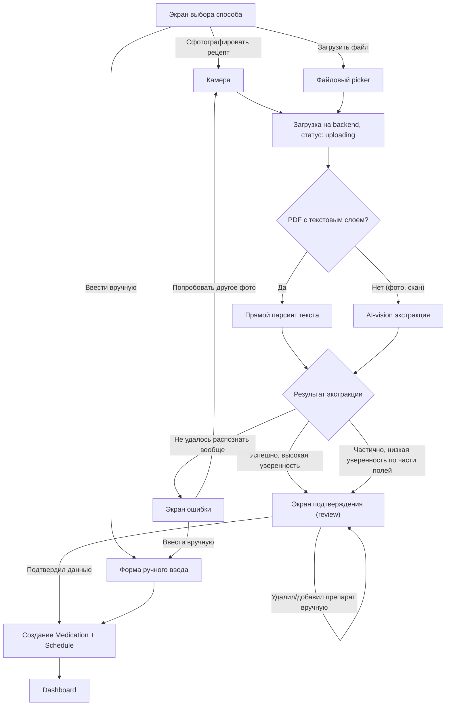
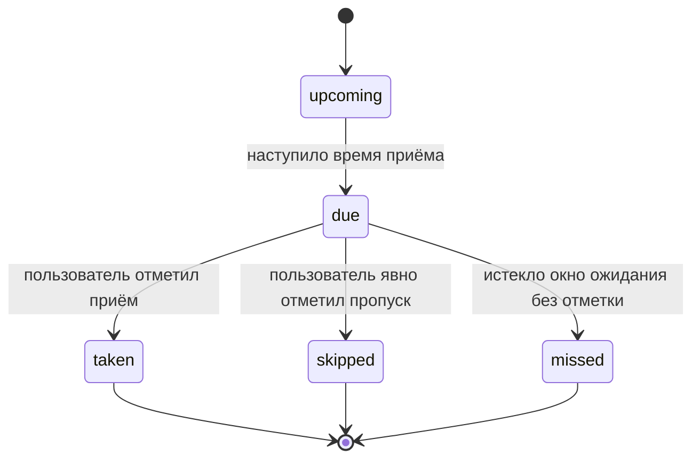

# Chill Pill — MVP Spec (Web)

**Версия:** 1.0
**Статус:** Draft для ревью командой
**Платформа:** Web (браузер, без установки)

---

## 1. Обзор и цель MVP

Chill Pill — веб-приложение для управления приёмом лекарств. Ключевое отличие от типовых reminder-приложений: пользователь не вводит лекарства вручную, а **фотографирует или загружает рецепт**, и AI сам извлекает препараты, дозировки и схему приёма.

**Core loop, который проверяет MVP:**

> Добавить лечение (AI-сканирование рецепта или ручной ввод) → получить напоминание → отметить приём одним тапом → увидеть свой прогресс (adherence score, streak).

Всё остальное в MVP существует, чтобы поддержать этот цикл, а не отвлекать от него.

---

## 2. Метрики успеха

| Метрика | Что показывает |
|---|---|
| % пользователей, добавивших ≥1 лечение после регистрации | Прошёл ли онбординг основной барьер |
| % загрузок рецепта, принятых без ручной правки полей | Качество AI-экстракции на реальных данных |
| % загрузок рецепта, закончившихся ручным вводом (fallback) | Где AI не справляется — сигнал для улучшения промпта/пайплайна |
| D7 / D30 retention | Закрепляется ли привычка |
| % запланированных доз, подтверждённых в пределах окна | Работает ли цикл "напоминание → отметка" |
| Средний adherence score по активным пользователям | Health-метрика продукта в целом |

---

## 3. Scope MVP (MoSCoW)

### Must have

| Фича | Комментарий |
|---|---|
| Регистрация / вход | Email + magic link или email+пароль. Без соцсетей в MVP |
| Добавление лечения через AI-сканирование рецепта | Фото или файл → AI извлекает препараты и схему |
| Добавление лечения вручную | Обязательный fallback, не "запасной", а равноправный путь |
| Экран подтверждения извлечённых данных | Каждое поле редактируемо, низкая уверенность подсвечена |
| Построение графика приёма | На основе подтверждённых данных |
| Главный экран "Сегодня" | Список доз на день, статус каждой |
| Отметка приёма в один тап | taken / skipped |
| История приёмов (лог) | Что, когда, принято или нет |
| Adherence score | Простой % за период |
| Напоминания (email) | Базовый канал, обязателен |
| Управление лечениями | Добавление / редактирование / удаление / архивация курса |

### Should have

| Фича | Комментарий |
|---|---|
| Streak counter | Дни подряд без пропуска |
| Учёт остатка таблеток | Вводится вручную начальное количество, не автоматический подсчёт |
| Treatment timeline | Визуальный прогресс курса (неделя X из Y) |
| Web push напоминания | Best-effort, не основной канал (см. раздел 8) |

### Could have (v1.1+)

- SMS-напоминания
- Графики/тренды adherence по времени дня и дням недели
- Адаптивные напоминания на основе паттерна пропусков
- Интеграция с eHealth/Helsi API для прямого вытягивания текста рецепта по коду (см. риски, раздел 12 — на момент написания публичного API для пациентских интеграций не подтверждено)

### Won't have в MVP

- Нативные iOS/Android-приложения — **лендинг сейчас обещает "Download for iOS/Android", это нужно скорректировать**, MVP — браузер/PWA
- Шеринг с врачом или близкими
- Поддержка SMS/Viber-кода e-рецепта как источника данных для AI (см. раздел 7.4 — там физически нет медицинских данных для извлечения)

---

## 4. User Flows

### 4.1 Общая карта

```
Landing → Sign up → Добавление первого лечения → Подтверждение → Dashboard
                                                                      │
                                              ┌───────────────────────┼───────────────────────┐
                                              ▼                       ▼                       ▼
                                    Отметка приёма дозы      Управление лечениями      Просмотр истории/прогресса
```

### 4.2 Flow: Добавление лечения (ядро продукта)



**Состояния флоу и их назначение:**

| Состояние | Что видит пользователь | Переход дальше |
|---|---|---|
| `entry_choice` | Три кнопки: сфотографировать / загрузить файл / ввести вручную | → capturing / manual_entry |
| `capturing` | Открыта камера или системный file picker | → uploading |
| `uploading` | Лоадер "Распознаём рецепт..." | → review / error |
| `review` | Карточки препаратов, все поля редактируемые, оригинал документа доступен для сверки, low-confidence поля визуально выделены | → confirmed |
| `extraction_failed` | "Не получилось распознать документ" + 2 действия | → capturing / manual_entry |
| `manual_entry` | Форма с теми же полями, что и в review, но пустая | → confirmed |
| `confirmed` | — (промежуточное, создаются записи) | → dashboard |

**Важное правило:** график приёма никогда не создаётся автоматически без прохождения через `review`. Даже при 100% уверенности AI пользователь обязательно видит и подтверждает итоговые данные.

### 4.3 Flow: Ежедневная отметка приёма



| Статус | Условие | Влияет на adherence score |
|---|---|---|
| `upcoming` | Время приёма ещё не наступило | Нет |
| `due` | Время приёма наступило, доза ожидает отметки, визуально выделена на дашборде | Нет |
| `taken` | Пользователь нажал "принял" | Засчитывается как выполненная |
| `skipped` | Пользователь явно отметил "пропустил" | Засчитывается как пропущенная |
| `missed` | Окно ожидания истекло (open question: точное значение окна, см. раздел 12), отметки не было | Засчитывается как пропущенная |

### 4.4 Flow: Управление лечениями

```
Список лечений → Открыть лечение → Редактировать поля → Сохранить
                                  → Архивировать/завершить курс → перемещается в "завершённые", не показывается на дашборде
```

Правило: изменение схемы приёма применяется только к будущим дозам, прошлый лог не пересчитывается retroactively.

---

## 5. Инвентарь экранов

| Экран | Loading state | Empty state | Error state |
|---|---|---|---|
| Dashboard "Сегодня" | Скелетон списка доз | "Добавьте первое лечение" + CTA | Не предусмотрен (данные локальные/кэш) |
| Добавление лечения — выбор способа | — | — | — |
| Загрузка рецепта | "Распознаём рецепт..." | — | "Не получилось распознать" + действия |
| Экран подтверждения (review) | — | — | Нет препаратов распознано → сразу предлагается ручной ввод |
| Ручной ввод | — | Пустая форма | Валидация полей (обязательные: название, дозировка, частота) |
| Список лечений | Скелетон | "Пока нет добавленных лечений" | — |
| История приёмов | Скелетон | "История появится после первых отметок" | — |
| Настройки | — | — | — |

---

## 6. Логика AI-экстракции рецептов

### 6.1 Pipeline

1. Пользователь загружает фото или файл
2. Backend проверяет тип файла:
   - **PDF с текстовым слоем** (типично для PDF из личного кабинета клиники) → прямой парсинг текста, без vision-модели
   - **Изображение или PDF-скан без текстового слоя** (фото рукописного или печатного рецепта) → AI-vision извлечение
3. Оба пути возвращают единую структуру данных (см. 6.3)
4. Результат уходит на экран подтверждения

### 6.2 Поддерживаемые источники

| Источник | Тип обработки | Ожидаемая точность |
|---|---|---|
| Рукописный бумажный рецепт (фото) | AI-vision | Низкая-средняя, сильно зависит от почерка |
| Печатный бумажный рецепт из клиники (фото) | AI-vision | Высокая |
| PDF из личного кабинета (электронный рецепт) | Прямой парсинг текста | Очень высокая |
| SMS/Viber-код e-рецепта (`0000-0000-0000-0000` + код подтверждения) | **Не поддерживается** | — |

**Почему код не поддерживается:** это токен авторизации для аптеки, а не документ с медицинскими данными. В нём нет названия препарата, дозировки или схемы — AI не может извлечь то, чего там нет. Если в будущем понадобится отразить такие коды в продукте, это отдельная небольшая фича "сохранить код для аптеки" как заметка, никак не связанная с построением графика приёма.

### 6.3 Выходная структура данных

```json
{
  "document_type": "handwritten | printed | electronic_pdf",
  "medications": [
    {
      "name": "string",
      "name_confidence": "high | medium | low",
      "dosage": "string",
      "dosage_confidence": "high | medium | low",
      "form": "string",
      "frequency_human": "string, например '2 раза в день'",
      "frequency_structured": {
        "times_per_day": "number | null",
        "specific_times": ["string"] 
      },
      "duration_days": "number | null",
      "start_date_hint": "string | null",
      "special_instructions": "string | null",
      "overall_confidence": "high | medium | low"
    }
  ],
  "extraction_warnings": ["string"]
}
```

### 6.4 Правила confidence и верификации

- Поле с `confidence: low` визуально подсвечивается на экране review — отдельным цветом/иконкой, не просто текстом
- Оригинал документа доступен на экране review (превью или кнопка "посмотреть оригинал"), чтобы пользователь мог визуально сверить, особенно для рукописных рецептов
- Если `overall_confidence` низкий по всему документу — экран review сразу предлагает ручной ввод как основной путь, а AI-результат подаётся как черновик, который можно поправить, а не готовый ответ
- Язык/сокращения: промпт для AI должен явно понимать типичные медицинские сокращения на русском/украинском (`по 1 т. 2 р/д`, `натощак`, `в/м`, `за 30 мин до еды`)

---

## 7. Логика напоминаний

| Канал | Статус в MVP | Комментарий |
|---|---|---|
| Email | Обязательный, основной | Надёжен независимо от браузера/устройства |
| Web Push | Best-effort | Работает только если пользователь дал разрешение и не закрыл уведомления; ограниченная поддержка на iOS Safari |
| SMS | Не в MVP | Кандидат на v1.1, особенно для критичных доз |

**Правило MVP:** один реминдер на дозу, без повторной отправки/эскалации при игнорировании. Snooze-функциональность не входит в MVP — слишком много логики веток для первой версии.

---

## 8. Модель данных

| Entity | Ключевые поля |
|---|---|
| **User** | id, email, timezone |
| **PrescriptionDocument** | id, user_id, file_url (зашифрованный), document_type, статус обработки (`uploading / processed / failed`), raw_ai_response (для дебага качества экстракции) |
| **Medication** | id, user_id, prescription_document_id (nullable, если добавлено вручную), название, дозировка, форма, дата начала, длительность курса или "постоянно", статус (`active / archived`) |
| **Schedule** | id, medication_id, время приёма (одно или несколько в день), дни недели |
| **IntakeLog** | id, schedule_id, дата/время по плану, статус (`taken / skipped / missed`), фактическое время отметки |
| **Reminder** | id, intake_log_id, канал, статус доставки |

---

## 9. Приватность и безопасность

- Загруженные фото/файлы рецептов — чувствительные медицинские данные. Требуют шифрования at rest и ограниченного доступа
- **Открытый вопрос для команды:** retention policy — храним ли исходное фото после успешной экстракции, или удаляем сразу, оставляя только структурированные данные (нужен legal/compliance вход)
- Фото рецептов никогда не должны попадать в аналитику, логи или crash reports
- На лендинге уже заявлено "Private by design", "We never sell your data" — реализация модели данных должна это подтверждать на практике, а не только на словах в маркетинге

---

## 10. Открытые вопросы для команды

1. Какое окно ожидания до перехода дозы в статус `missed`? (Например, 4 часа — нужно решить как дефолт)
2. Retention policy для фото рецептов — хранить зашифрованным или удалять после извлечения?
3. Юридический статус AI-распознавания медицинских данных в регионе: нужен ли явный дисклеймер на экране review вида "проверьте данные перед использованием, это не медицинская консультация"?
4. Провайдер push-уведомлений в браузере — с учётом ограничений iOS Safari
5. Целесообразность интеграции с eHealth/Helsi API в будущем — есть ли публичный API для пациентских сценариев, или доступ только у аптек/врачей

---

## 11. Явно вне скоупа MVP (recap)

- Нативные мобильные приложения
- Шеринг данных с врачом/близкими
- SMS/Viber e-рецепт коды как источник для AI
- Адаптивные/умные напоминания на основе паттернов поведения
- Графики и тренды adherence (только итоговый % в MVP)
- Snooze для напоминаний
